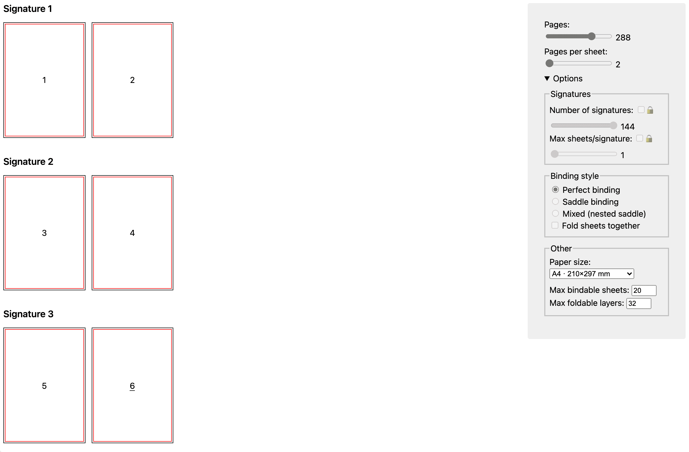

# 📔 Imposition Guide

**A visual guide to impose pages on printed sheets.**

**Features:**
- 📃 Support for 8 different [N-up layouts](https://en.wikipedia.org/wiki/N-up): (1, 2, 4, 6, 8, 12, 16, 18)-up, from *folio* to *octodecimo*.
- 🪡 Support for 3 binding types: perfect, saddle and mixed.
- 📎 Support for signatures.
- 🪄 Automatic selection of the optimal number of signatures based on other options.
- ➕ Possibility to impose sheets to be fold together.
- 🔢 Customizable number of sheets foldable or bindable at once.

***

